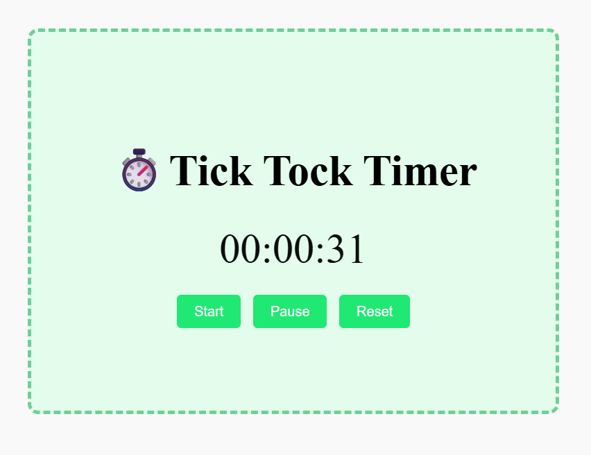

# Stopwatch App

A simple stopwatch built using HTML, CSS, and JavaScript. It lets you start, pause, and reset time — perfect for learning DOM manipulation and time-based JavaScript functions.

# Screenshot

# Features

Start, pause, and reset the stopwatch

Displays time in hh:mm:ss format

Prevents multiple intervals

Simple and clean UI

# Tech Stack

HTML5

CSS3

JavaScript (Vanilla)

# How I Built It

1. HTML to create the structure (time display and buttons).

2. CSS to style the stopwatch with flexbox and button hover effects.

3. JavaScript to control:

setInterval() for time updates

clearInterval() to stop timer

DOM updates to display time in real-time

# What I Learned

How to use setInterval() and clearInterval()

Updating DOM elements dynamically

Handling button events with addEventListener or onclick

Time logic: incrementing seconds, minutes, and hours
